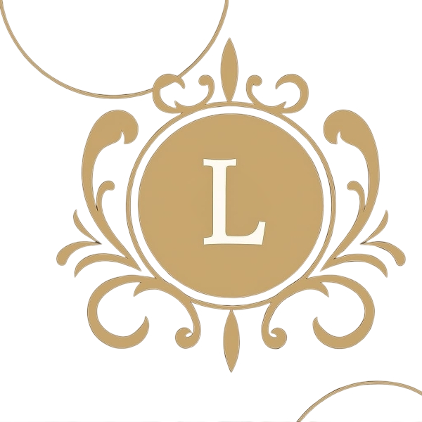
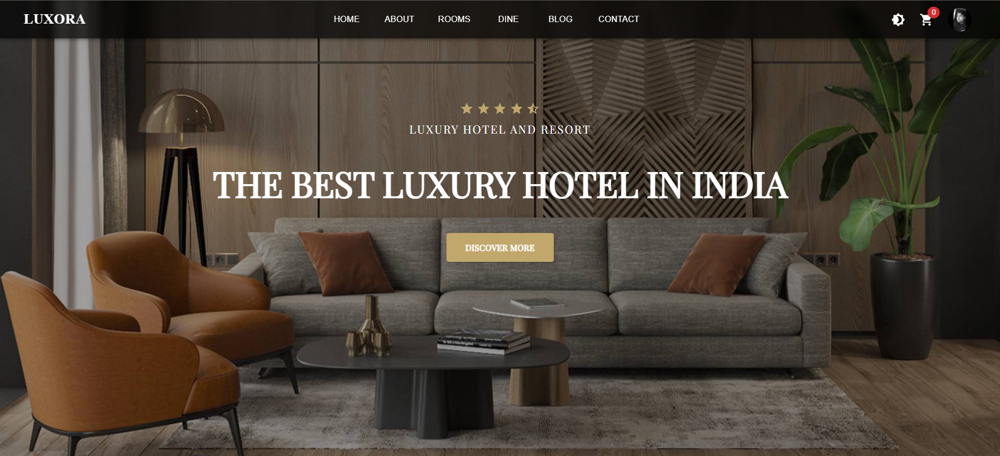
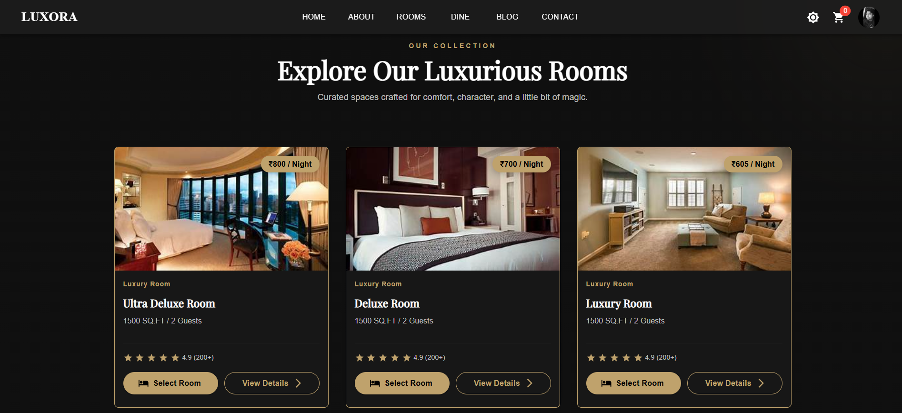
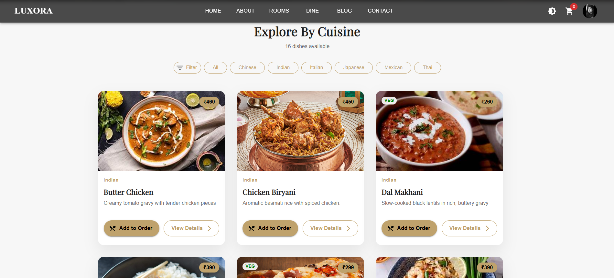
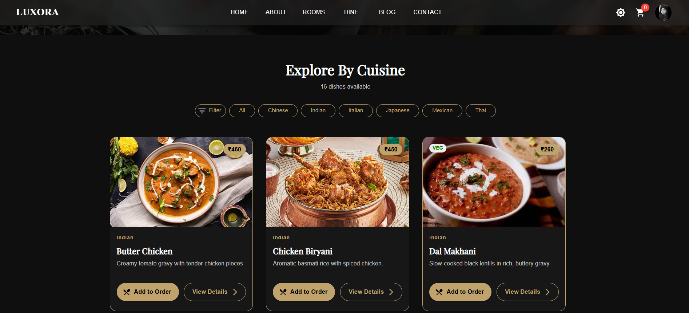
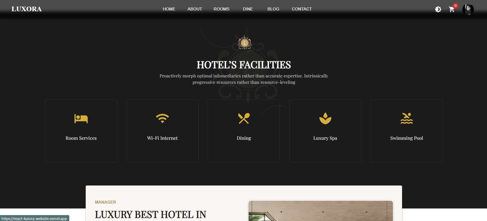

## 🏩 Luxora — Luxury Hotel & Resort Website

Premium, production-ready React application for a luxury hospitality brand. Crafted with a refined UI (gold accents, dark/light themes), smooth motion, and a real backend powered by Supabase.

  

## ✌️Vercel Link
https://react-luxora-website.vercel.app

## 📸 Screenshots and Demos
  
    
  
  
  

## ✨ Features

- Elegant, responsive UI with **MUI 5** + **Framer Motion**
- Themed: **Dark/Light** with Luxora gold accent
- Pages & flows:
  - Home, Rooms Grid, Dining, Spa, Blogs (Testimonials), Contact
  - Cart (Rooms + Food) with totals, step-by-step **Checkout**
  - **Auth** (Sign in / Sign up) with profile avatar upload
- **Supabase** backend: Auth, Storage (avatars), DB (users, blogs, carts)
- **Redux Toolkit** state for products/cart
- Sweet alerts and toasts for delightful feedback

---

## 🧰 Tech Stack

- **React 18**
- **MUI v5** (Material UI)
- **Framer Motion**
- **React Router v6**
- **Redux Toolkit**
- **Supabase** (Auth, Database, Storage)
- **SweetAlert2**, **react-hot-toast**

> Build tooling: works with **Vite** (`npm run dev`) or CRA (`npm start`).

---

